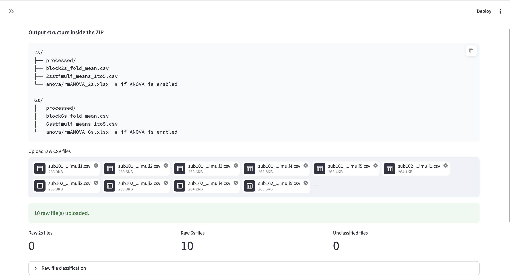
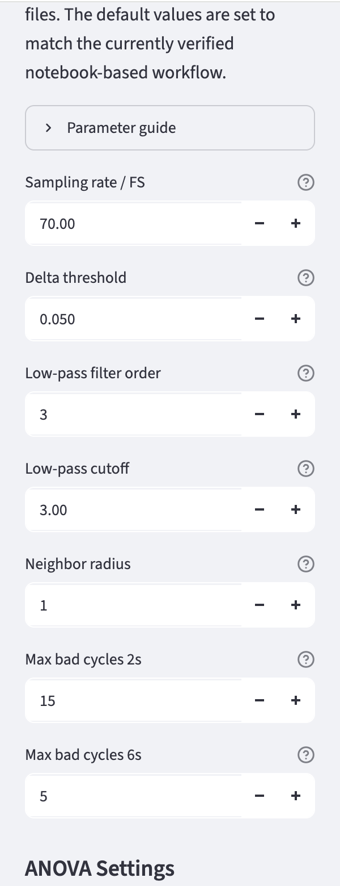
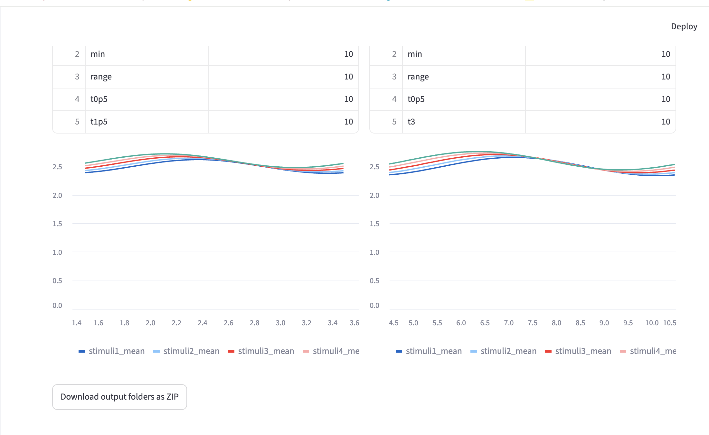

# Pupillary Diameter Analysis App

## 概要

このアプリは、瞳孔径実験データの前処理、周期平均、刺激別平均、統計解析を一括で行うためのデータ解析アプリである。

卒業研究では、特定条件下で変化する動向の半径を、2秒条件と6秒条件の分離、出力ファイルの整理が煩雑であった。

そこで、PythonとStreamlitを用いて、CSVファイルのアップロードから前処理、品質管理、周期平均、刺激別平均、反復測定ANOVA、ZIP出力までを一つのアプリケーションとして統合した。

## 主な機能

* 複数CSVファイルのアップロード
* ファイル名に基づく2秒条件・6秒条件の自動分類
* 左眼データを対象とした瞳孔径データ処理
* blinkおよび低信頼度データの除外
* 急激な瞳孔径変化に基づくノイズ除去
* 周期単位の品質管理
* 信頼性の低いデータの除外
* 70Hzへのリサンプリング
* ローパスフィルタ処理
* 条件別のprocessed CSV出力
* 2秒条件・6秒条件ごとの周期平均
* stimuli1〜stimuli5ごとの平均波形作成
* 反復測定ANOVAの実行
* 解析結果を整理したZIPファイル出力

## 出力構成

```text
pupil_analysis_results.zip
├── qc_summary.csv
├── 2s/
│   ├── processed/
│   │   └── processed_*.csv
│   ├── block2s_fold_mean.csv
│   ├── 2sstimuli_means_1to5.csv
│   └── anova/
│       └── rmANOVA_2s.xlsx
└── 6s/
    ├── processed/
    │   └── processed_*.csv
    ├── block6s_fold_mean.csv
    ├── 6sstimuli_means_1to5.csv
    └── anova/
        └── rmANOVA_6s.xlsx
```

## 使用技術

* Python
* Streamlit
* pandas
* NumPy
* SciPy
* Pingouin
* OpenPyXL

## セットアップ方法

```bash
python3 -m venv .venv
source .venv/bin/activate
pip install -r requirements.txt
streamlit run app.py
```

## サンプルデータ

このリポジトリには、動作確認用の合成ダミーデータを `sample_data/` に含めている。

実験参加者の個人情報および研究データ保護のため、実際の実験データは公開していない。サンプルデータは、元データのファイル名規則と列構造を参考に作成した合成データである。

## スクリーンショット

### アップロード画面


### パラメータ設定


### 結果


## 工夫した点

* 2秒条件と6秒条件を最初の入力ファイル名の段階で分類し、解析結果が混ざらないようにした。
* アプリのサイドバーに各パラメータの説明を追加し、使用者が処理内容を理解しながら実行できるようにした。
* 出力ZIP内のフォルダ構成を整理し、後続解析や結果確認がしやすい形にした。

## このプロジェクトで学んだこと

* データ処理パイプラインの設計
* StreamlitによるUI実装
* pandas / NumPy / SciPyを用いた時系列データ処理
* 実験データに対する品質管理処理
* 解析結果を再現可能な形で出力する設計

